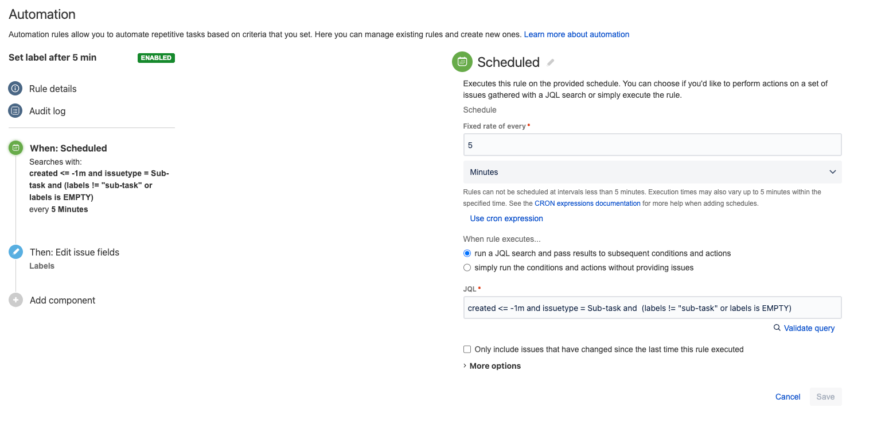
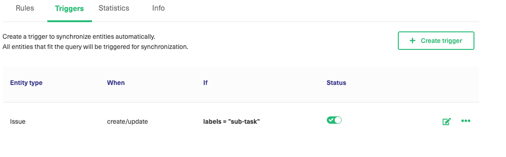

# Sync over Sub-task Jira cloud & onPrem

#### [Jira Cloud](https://docs.exalate.com/docs/how-to-sync-tasks-and-subtasks-in-jira-cloud)

On Jira cloud this is fully automated, when a newsub-task is created this will automatically sync wihtout the help of a [trigger](https://docs.exalate.com/docs/triggers-in-exalate).

We use the rest API to see if a newsub-task is created in a already synced issue.

#### [Jira onPrem](https://docs.exalate.com/docs/how-to-sync-tasks-and-subtasks-in-jira-on-premise)

In Jira onPrem this needs a bit more off attention.

Even if you create an ordinary [trigger](https://docs.exalate.com/docs/triggers-in-exalate) when a new sub-task is created it could be that the parentId field is not updated on the sub-task.

Meaning the sub-task will be created on the remote site but it will be created as a Task or other issue typ (depending what your default issue Type is).

So we have to delay this process, the way you can do this is as follows.

###### Automation:

1. You need to create an automation that will add a label on your sub-tasks (this will trigger the sync).
2. The automation Trigger should be of the type ***Scheduled***
3. Set the fixed rate to 5 minutes and add a JQL when the rule should be executed.
   1. JQL: **created <= -1m and issuetype = Sub-task and  (labels != "sub-task" or labels is EMPTY)**
4. Uncheck the "Only include issues that have changed since the last time this rule executed"
5. Add a new action: "Edit Issue"
6. Choose the **Labels** field and add the label "sub-task"
7. Save the configuration and you're all set

###### Exalate trigger

1. Create a new trigger in your connection that checks on a specific label:
   1. Ex: **labels = "sub-task"**

You're all set now the process to fully automate the sync of a sub-task in Jira onPrem is done.

The delay for a sub-task to sync is maximum 5 min.

Please check the images below to give you an idea how it should look like.

